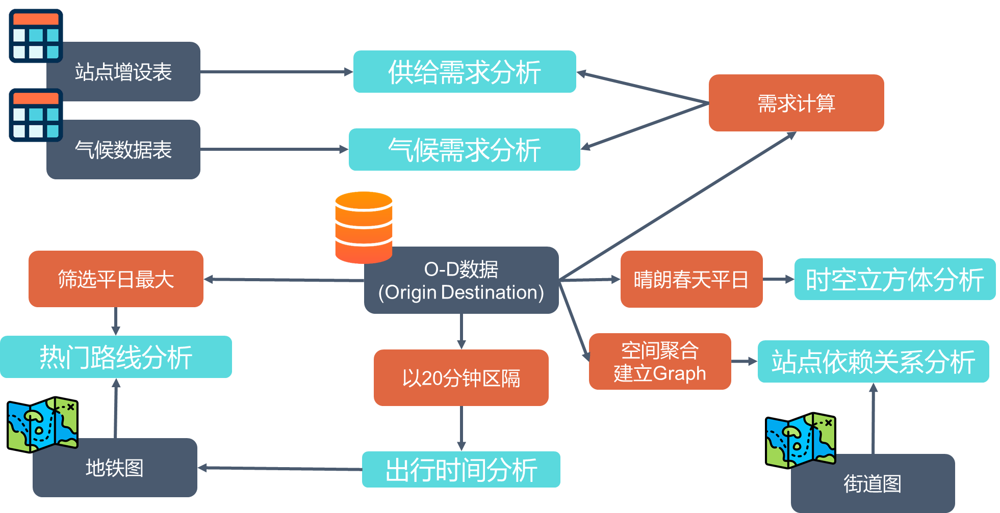

# Youbike Visualization

## Target

1. Explore the **last mile** in the YouBike System.
2. Using **Space Time Cube** to utilize the visualuzation.
3. Understanding the relationship of Youbike supply, demand and climate.

## Workflow

## links

| 可视化                     | 相关技术                                  | links                                                                                            |
|----------------------------|-------------------------------------------|--------------------------------------------------------------------------------------------------|
| 供给需求与气候分析        | Line chart, Bar Chart                     | [https://chuang091.github.io/VisualizationFinal/gsx_merge_linechart](https://chuang091.github.io/VisualizationFinal/gsx_merge_linechart) |
| 热门路线分析               | Bar chart, Leaflet                        | [https://chuang091.github.io/VisualizationFinal/toproute.html](https://chuang091.github.io/VisualizationFinal/toproute.html)             |
| 出行时间分析               | Bar chart, Leaflet                        | [https://chuang091.github.io/VisualizationFinal/2060.html](https://chuang091.github.io/VisualizationFinal/2060.html)                     |
| 站点依赖关系分析           | Force directed graph, Pie chart, Leaflet | [https://chuang091.github.io/VisualizationFinal/flow.html](https://chuang091.github.io/VisualizationFinal/flow.html)                     |
| 时空立方体分析             | Arcgis Pro, Line chart, Arcgis API for JS | [https://chuang091.github.io/VisualizationFinal/spaceTimecube.html](https://chuang091.github.io/VisualizationFinal/spaceTimecube.html)   |
