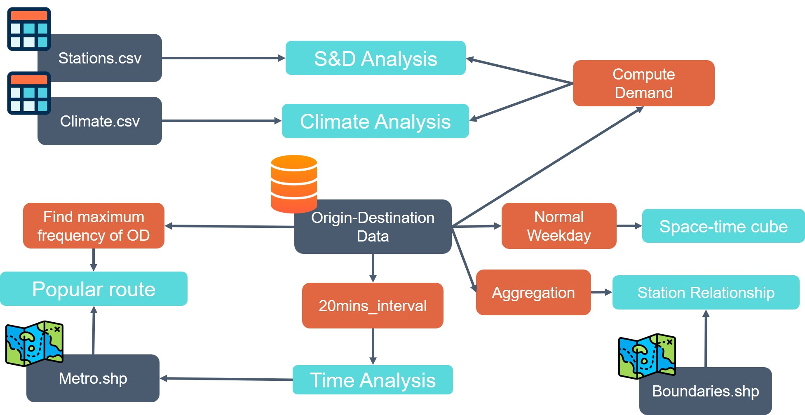

# Youbike Visualization

As a new mode of urban short-distance travel, shared bikes have played a positive role in alleviating traffic congestion and improving environmental quality. However, better understanding and utilization of shared bike usage data is of great significance for urban transportation planning and management.

## Youbike Information

- System: YouBike 2.0
- Mobility: No
- Regions: Northern, Central, and Southern Taiwan
- Research Area: Taipei City
- Number of Stations: Approximately 1,500
- Number of Bicycles: Approximately 30,000
- Established: 2021 to present

## Target

1. Explore the **last mile** in the YouBike System.
2. Utilize **Space Time Cube** for visualization.
3. Understand the relationship between Youbike supply, demand, and climate.

## Workflow

## Links

| Visualization              | Techniques Used                           | Links                                                                                           |
|----------------------------|-------------------------------------------|--------------------------------------------------------------------------------------------------|
| Supply, Demand, and Climate Analysis | Line chart, Bar Chart                     | [https://chuang091.github.io/VisualizationFinal/gsx_merge_linechart](https://chuang091.github.io/VisualizationFinal/gsx_merge_linechart) |
| Popular Route Analysis     | Bar chart, Leaflet                        | [https://chuang091.github.io/VisualizationFinal/toproute.html](https://chuang091.github.io/VisualizationFinal/toproute.html)             |
| Travel Time Analysis       | Bar chart, Leaflet                        | [https://chuang091.github.io/VisualizationFinal/2060.html](https://chuang091.github.io/VisualizationFinal/2060.html)                     |
| Station Dependency Analysis| Force directed graph, Pie chart, Leaflet | [https://chuang091.github.io/VisualizationFinal/flow.html](https://chuang091.github.io/VisualizationFinal/flow.html)                     |
| Space-Time Cube Analysis   | Arcgis Pro, Line chart, Arcgis API for JS | [https://chuang091.github.io/VisualizationFinal/spaceTimecube.html](https://chuang091.github.io/VisualizationFinal/spaceTimecube.html)   |

## Conclusion and Discussion

1. Climate has a significant impact on travel demand.
2. Supply drives demand, not the other way around.
3. The importance of the last mile in shared biking is evident from the analysis of popular routes and travel times.
4. The Space-Time Cube reveals the residential and commercial orientation of different areas.